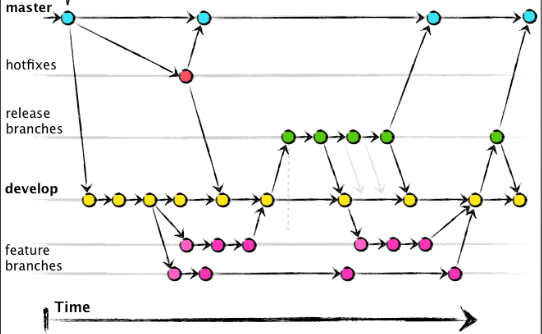

# Metodologia

Esta seção descreve a organização da equipe para a execução das tarefas do projeto e as ferramentas utilizadas para a manutenção dos códigos e demais artefatos.

## Controle de versão
A gestão do desenvolvimento da aplicação será feita utilizando
GitFlow, que é uma estratégia de controle de versão 
utilizando o Git, criada por Vincent Driessen. Ela define um modelo estruturado de como organizar e gerenciar as 
branches (ramificações) de um repositório Git para otimizar o desenvolvimento de projetos de software,
especialmente aqueles que seguem um cronograma de lançamentos.
A seguir, uma descrição de como o GitFlow pode ser aplicado no controle de versão de um projeto de software usando o GitHub.

###

### Inicialização

Para começar a usar o GitFlow em um projeto existente, primeiro é necessário inicializá-lo no repositório local. Isso configura as branches principais para desenvolvimento e produção, normalmente chamadas de develop e master respectivamente.

#### Branches Principais

<b> Master: </b> A branch master armazena o histórico oficial de lançamento do projeto. Cada commit na branch master 
representa um novo lançamento de software no GitHub, estando sempre em um estado pronto para produção. 
<b> Develop:</b> A branch develop serve como uma branch de integração para recursos a serem incluídos no próximo 
lançamento.
Essa é a branch "viva" onde as funcionalidades desenvolvidas são continuamente integradas.

#### Branches de Suporte

Além das branches principais, o GitFlow utiliza várias branches de suporte para auxiliar no desenvolvimento paralelo de recursos, facilitar correções de bugs e preparar lançamentos de software.

<b>Feature branches:</b> Criadas a partir da develop, são usadas para desenvolver novas funcionalidades. Uma vez 
concluídas, são mescladas de volta à develop. Exemplo: feature/novo-login.  
<b>Release branches:</b> Criadas a partir da develop, são usadas para preparar lançamentos de software, permitindo 
ajustes finais e preparação de metadados de lançamento. Após a conclusão, são mescladas em master e develop. Exemplo: release/1.0.0.
 <b>Hotfix branches:</b> Criadas a partir da master, são usadas para correções rápidas em produção. Após a correção, são 
mescladas de volta em master e develop, e o master é marcado com uma nova versão. Exemplo: hotfix/correcao-bug-login.

### Fluxo de Trabalho

<b>Desenvolvimento de Funcionalidades:</b> Inicia-se com a criação de uma branch feature a partir da develop. Após o 
desenvolvimento, essa branch é revisada por meio de Pull Requests (PR) e então mesclada de volta à develop.

<b>Preparação de Lançamento:</b> Quando as funcionalidades para a próxima versão estão prontas, uma branch release é 
criada a partir da develop. Alterações de última hora e preparação de metadados de lançamento são feitas nesta branch. Após a conclusão, ela é mesclada em master e develop, e o master é marcado com uma nova versão.

<b>Correções de Produção:</b> Se um bug crítico é encontrado em produção, uma branch hotfix é criada a partir da master. Após a correção, a hotfix é mesclada de volta em master e develop, e o master recebe uma nova tag de versão.

## Gerenciamento de Projeto
A metodologia SCRUM foi escolhida para o desenvolvimento do projeto "AgendaClin" devido à sua adaptabilidade, eficiência em ambientes de desenvolvimento que experimentam mudanças frequentes e sua capacidade de entregar produtos de alta qualidade de maneira iterativa. O SCRUM é centrado na colaboração do time, auto-organização e flexibilidade para adaptar-se às mudanças de requisitos do projeto, o que é crucial para o sucesso do desenvolvimento de uma plataforma inovadora como o "AgendaClin". Segundo Schwaber (2013)
“Scrum é um framework para desenvolver e manter produtos complexos, esta definição consiste em papéis, eventos, artefatos e as regras do Scrum que unem os demais e os mantém integrados. Ken Schwaber e Jeff Sutherland desenvolveram o Scrum, o Guia do Scrum é escrito e fornecido por eles.”

### Divisão de Papéis
No contexto do SCRUM, a equipe do projeto "AgendaClin" é composta por:

A equipe utiliza o Scrum como base para definição do processo de desenvolvimento.

- Scrum Master: Giovanni Shintaku
- Product Owner: Yasmim Nunes
- Equipe de Desenvolvimento: Breno Marques, Giovanni Shintaku, Ícaro Cota, Michael  Brasil, Vinicius lima, Yasmim Nunes
- Equipe de Design: Ícaro Cota, Michael  Brasil

> **Links Úteis**:
> - [11 Passos Essenciais para Implantar Scrum no seu 
> Projeto](https://mindmaster.com.br/scrum-11-passos/)
> - [Scrum em 9 minutos](https://www.youtube.com/watch?v=XfvQWnRgxG0)

### Processo

Para a organização e distribuição das tarefas do projeto, a equipe está utilizando o GitHub, estruturado com as seguintes listas que refletem as cerimônias e artefatos do SCRUM:

- <b>Backlog:</b> Mantido no GitHub, contém todas as funcionalidades, requisitos, e melhorias planejadas para o produto. 
  Este é constantemente atualizado pelo Product Owner conforme novas necessidades surgem.  
- <b>To Do:</b> As tarefas selecionadas para a Sprint atual são listadas aqui, representando o foco imediato da equipe de desenvolvimento.
- <b>In Progress:</b> As tarefas que estão sendo atualmente trabalhadas pela equipe. Isso assegura transparência e permite 
  que todos na equipe saibam o que está sendo desenvolvido. 
- <b>Done</b>: Tarefas completadas, testadas, e prontas para serem entregues. Isso inclui funcionalidades que 
  passaram por controle de qualidade e estão prontas para implantação.  

O quadro do Kanban do grupo está disponível no link https://github.com/orgs/ICEI-PUC-Minas-PMV-ADS/projects/1003/views/1
está sendo apresentado no estado atual na figura abaixo:

Tela do Kaban no GitHub utilizada pelo grupo

> **Links Úteis**:
> - [Project management, made simple](https://github.com/features/project-management/)
> - [Sobre quadros de projeto](https://docs.github.com/pt/github/managing-your-work-on-github/about-project-boards)
> - [Como criar Backlogs no Github](https://www.youtube.com/watch?v=RXEy6CFu9Hk)
> - [Tutorial Slack](https://slack.com/intl/en-br/)

### Etiquetas

As tarefas são, ainda, etiquetadas em função da natureza da atividade e seguem o seguinte esquema de cores/categorias:

<ul>
  <li>Bug (Erro no código)</li>
  <li>Desenvolvimento (Development)</li>
  <li>Documentação (Documentation)</li>
  <li>Gerência de Projetos (Project Management)</li>
  <li>Infraestrutura (Infrastructure)</li>
  <li>Testes (Tests)</li>
</ul>

<figure> 
   Tela do esquema de cores e categorias</figcaption>
</figure>
  
### Ferramentas

[Descreva aqui as ferramentas empregadas no projeto e os ambiente de trabalho utilizados pela  equipe para desenvolvê-lo. Abrange a relação de ambientes utilizados, a estrutura para gestão do código fonte, além da definição do processo e ferramenta através dos quais a equipe se organiza (Gestão de Times).]

Os artefatos do projeto são desenvolvidos a partir de diversas plataformas e a relação dos ambientes com seu respectivo propósito é apresentada na tabela que se segue.

| AMBIENTE                            | PLATAFORMA                         | LINK DE ACESSO                         |
|-------------------------------------|------------------------------------|----------------------------------------|
| Repositório de código fonte         | GitHub                             | http://....                            |
| Documentos do projeto               | GitHub                             | https://github.com/ICEI-PUC-Minas-PMV-ADS/pmv-ads-2024-1-e1-proj-web-t13-agendaclin                           |
| Projeto de Interface                | Figma                              | https://www.figma.com/file/NXWheuLV7lRZKXkaibOAVK/AgendaClin?type=design&node-id=0%3A1&mode=design&t=wCATpf08njL16Vfl-1                           |
| Gerenciamento do Projeto            | GitHub Projects                    | https://github.com/orgs/ICEI-PUC-Minas-PMV-ADS/projects/1003                            |
| Hospedagem                          | GitHub Pages                       | http://....                            |

### Estratégia de Organização de Codificação 

Todos os artefatos relacionados a implementação e visualização dos conteúdos do projeto do site deverão ser inseridos na pasta [codigo-fonte](http://https://github.com/ICEI-PUC-Minas-PMV-ADS/WebApplicationProject-Template-v2/tree/main/codigo-fonte). Consulte também a nossa sugestão referente a estratégia de organização de codificação a ser adotada pela equipe de desenvolvimento do projeto.
